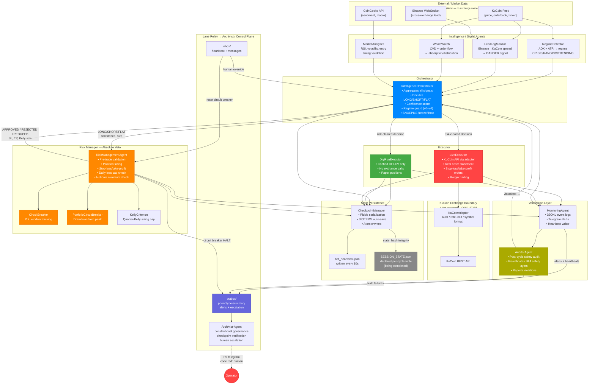
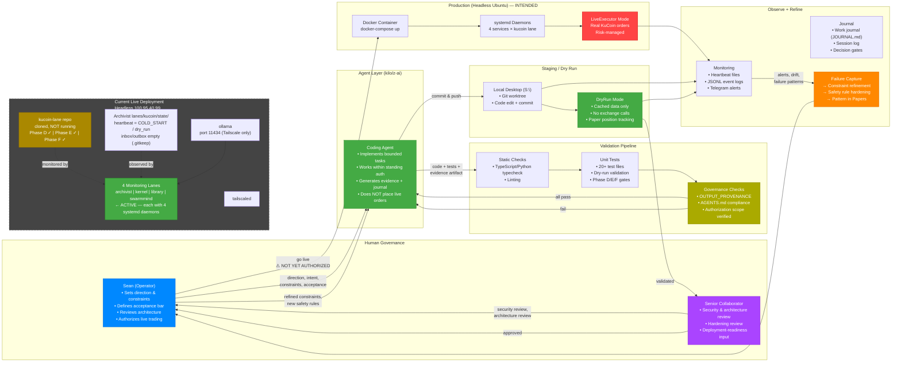
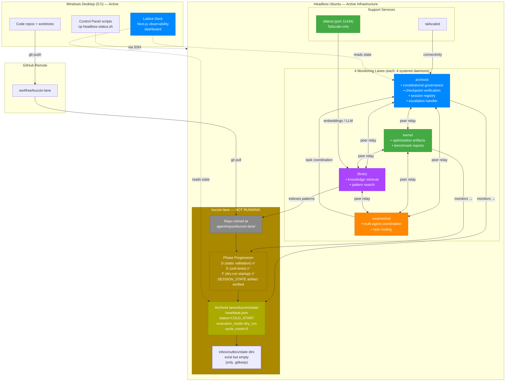

# KuCoin Lane — Collaborator Diagram Packet

**Audience:** Senior IT/security developer joining the project
**Purpose:** Orient quickly — system architecture, safety gates, collaboration workflow, deployment reality
**Date:** 2026-05-16

This packet separates intended bot architecture, planned development workflow, and current deployment reality. Diagrams 1 and 2 are the core orientation diagrams. Diagram 3 is included to keep implemented state distinct from target state.

> **⚠ CURRENT DEPLOYMENT REALITY (as of 2026-05-16):**
> KuCoin Lane is **NOT running in production**. Phase D (static validation) ✅, Phase F (dry-run startup) ✅ — one controlled cycle executed and verified on both Windows and headless. The bot is in `COLD_START` / `dry_run` mode on the headless machine — no live trading, no exchange API calls, no systemd services, no Docker containers. SESSION_STATE.json emitted at `lanes/kucoin/inbox/` with correct `status=shutdown`, `phase=terminating`, `final=true`, `cycle_count=1`.
>
> **What IS running on headless (100.95.40.99):** 4 monitoring lanes — **archivist, kernel, library, swarmmind** — each with 4 systemd daemons (heartbeat, lane-worker, relay-daemon, autonomous-executor). These lanes monitor the kucoin lane's state directory and heartbeat.
>
> Diagrams 1-2 below show the **INTENDED architecture**. Diagram 3 shows the **current live deployment reality**.

---

## Diagram 1: Runtime Trading Workflow — INTENDED Architecture

**Caption (INTENDED):** The KuCoin Lane operates as a 4-role autonomous trading ensemble within a single process. External market data feeds intelligence agents (RegimeDetector, LeadLagMonitor, WhaleWatch, MarketAnalyzer) that pass signals to the Orchestrator. The Orchestrator decides trade direction with a confidence score, then submits to the RiskManager which has absolute veto — it can APPROVE, REJECT, or REDUCE every trade. If cleared, the Executor handles placement through either DryRun (paper, no API calls) or Live (real KuCoin orders) mode. Every cycle is logged by the MonitoringAgent and audited by the AuditorAgent for safety-layer correctness. CheckpointManager persists state on every cycle with hash-verified integrity. All alerts, escalations, and heartbeats flow through lane-relay (filesystem mount) to the Archivist-Agent, which escalates to human for P0 events like circuit breaker HALT. **Formerly known gap — CLOSED:** SESSION_STATE.json per-cycle writer was declared required; now implemented with `phase` and `final` fields, verified 302/302 tests green on Windows + headless. **Reality: This architecture is NOT live — kucoin bot is in COLD_START/dry_run, phases E+F queued, no exchange connectivity.**

---

## Diagram 2: Development and Review Workflow

**Caption:** Development follows a human-governed, agent-assisted loop. Sean sets direction and constraints; coding agents implement bounded tasks within standing authorization (non-destructive only, no live trading without explicit approval). Every change passes through validation pipeline (typecheck, tests, governance compliance), then dry-run locally before reaching the collaborator for security/architecture review. Only after collaborator sign-off and Sean's explicit go-live does code reach the headless Ubuntu production environment with LiveExecutor. All production behavior is monitored, journaled, and fed back into constraint refinement — this is the "failure → detection → correction → constraint hardening" loop documented in Sean's Papers. **Current reality:** The "Production (Headless Ubuntu)" block is aspirational. What IS running on headless are 4 monitoring lanes (archivist/kernel/library/swarmmind) with 16 systemd daemons and ollama. The kucoin repo is cloned but idle (Phase D done, E+F queued). **Key distinction:** This is not "Sean asks random AIs to edit a trading bot." It is a governed, verified, multi-gate development pipeline with explicit human authorization at every risk-relevant boundary — and the kucoin bot hasn't yet passed through all its gates to reach production.

---

## Diagram 3: Current Live Deployment — Headless (100.95.40.99)

**Caption:** This is the actual production topology as of 2026-05-16. The 4 monitoring lanes (archivist, kernel, library, swarmmind) are the active infrastructure — each is a systemd service ensemble with heartbeat, lane-worker, relay-daemon, and autonomous-executor daemons. They communicate peer-to-peer via lane-relay filesystem mounts and monitor the kucoin lane's state directory. The kucoin lane itself is present (repo cloned, phase tracker at D ✅) but **not executing**: its heartbeat reads `COLD_START` / `dry_run`, cycle_count=0, and relay inbox/outbox/state directories are empty (only .gitkeep files). ollama runs on port 11434 (Tailscale-only) providing embeddings/LLM for the library lane. The Lattice Deck (Next.js observability dashboard) and control panel scripts live on the Windows desktop only — not deployed on headless.

**Key insight for collaborators:** When you join, the 4-lane monitoring mesh is the live system you should understand first. The kucoin trading bot is the *next* lane to go live, once Phases E+F pass and Sean authorizes the transition from COLD_START.

---

## What These Diagrams Tell a Collaborator in 30 Seconds

1. **The bot is a 4-role ensemble** — Orchestrator (decides) → RiskManager (vetoes) → Executor (acts) → Auditor (verifies). No single agent touches both decision-making and the exchange. **But: this architecture is NOT yet live.**
2. **Safety is structural, not aspirational** — RiskManager has absolute veto, circuit breakers are independent, auditor re-validates after every cycle, and human escalation is wired for P0 events.
3. **Development is governed, not wild** — Agents implement bounded tasks within explicit authorization. Every path to production passes through tests, governance checks, dry-run validation, collaborator review, and Sean's explicit go-live signal.
4. **Paper F is real** — The system actually does "failure → detection → correction → constraint refinement." It's not theoretical. The journal, heartbeat monitoring, alert pipeline, and lane-relay are live.
5. **What IS live: 4 monitoring lanes** — Archivist, kernel, library, and swarmmind are running on headless with 16 systemd daemons. They form a peer-relay mesh that monitors the kucoin lane's state. KuCoin bot is in COLD_START, Phase D ✅, E ✅, F ✅, SESSION_STATE artifact verified.

## Questions Collaborators Should Ask

1. **Phases D ✅ E ✅ F ✅ are complete.** What is the next gate before sustained dry-run (Phase G)? Should the session state artifact path be registered in the monitoring lanes' heartbeat consumer?
2. **The 4 monitoring lanes are live.** Should we evaluate their health and reliability before adding kucoin to the production mesh?
3. **The risk layer uses hardcoded asset configs** (BTC/ETH/SOL/USDT) in `risk_manager.py`. Should these be externalized before live trading?
4. **Auditor does not halt trading on failure** — only flags. Is this the right tradeoff, or should audit failure block the next cycle?
5. **ollama is running but not yet integrated** with the library lane for embeddings. Is this a dependency for kucoin lane operations?
6. **Lattice Deck (Next.js dashboard)** exists on Windows only. Should it be deployed on headless before kucoin goes live?
7. **~~CLOSED~~ SESSION_STATE.json per-cycle writer** — implemented with `phase`/`final` fields, 302/302 tests green on both platforms.

---

OUTPUT_PROVENANCE:
  agent: kilo
  lane: kucoin
  generated_at: 2026-05-16T15:48:00-04:00
  session_id: we4free-lattice-deck-2026-05-16-v2
  target: collaborator-orientation-diagrams
